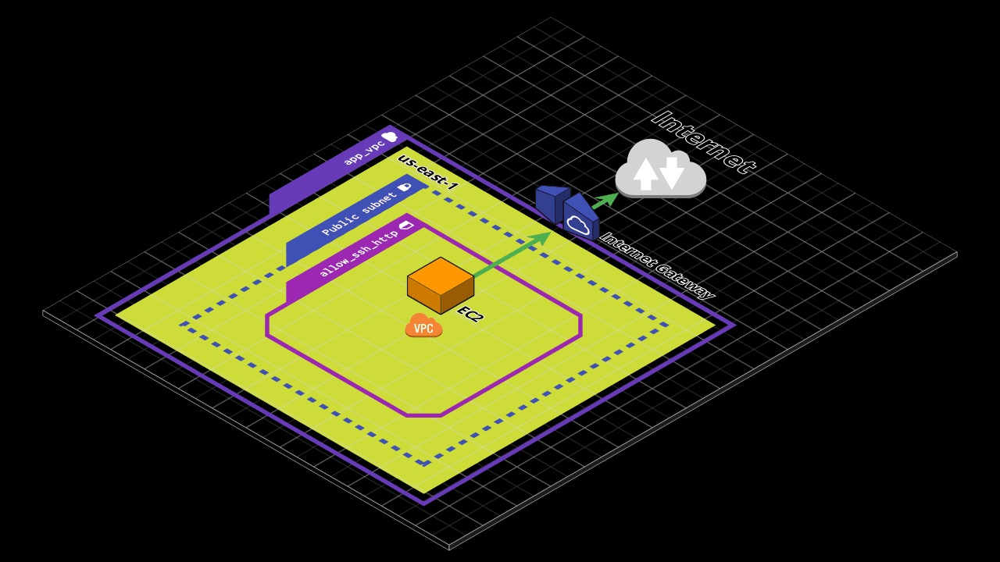

[](https://infrati.dev)

##### Provisionado uma ec2 utilizando o userdata para instalar um servidor web utilizando remote state com S3 e DynamoDB para locking .

##### Utilizado o Workflow do GitHub Action.

##### Estrutura provisionada



##### Requirements

* AWS_ACCESS_KEY_ID e AWS_SECRET_ACCESS_KEY cadastradas no github e parametrizadas na AWS com as pemissões para os recursos utilizados.
* Remote state com S3 e DynamoDB para locking previamente criados.

##### No Pull Request será executado o Plan

```
- name: Terraform fmt
        id: fmt
        run: terraform fmt -check

      - name: Terraform Init
        id: init
        run: terraform init

      - name: Terraform Validate
        id: validate
        run: terraform validate -no-color

      - name: Terraform Plan
        id: plandev
        run: terraform plan
```

##### Pull Request aprovado e feito o merge será executado o apply

```
 - name: Terraform fmt
        id: fmt
        run: terraform fmt -check

      - name: Terraform Init
        id: init
        run: terraform init

      - name: Terraform Validate
        id: validate
        run: terraform validate -no-color

      - name: Terraform Apply
        run: terraform apply -auto-approve
```

<br>

[](https://infrati.dev)


